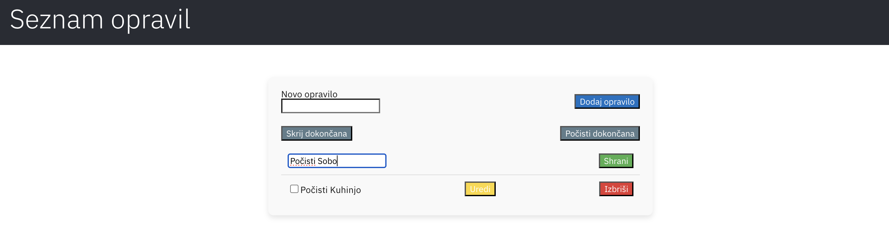

 # Aplikacija za Seznam Opravil (Todo List)

To je preprosta aplikacija za seznam opravil, zgrajena z uporabo React in komponent iz Carbon Design System.

## Funkcionalnosti

- Dodajanje novih opravil
- Označevanje opravil kot opravljena ali neopravljena
- Urejanje obstoječih opravil
- Brisanje opravil
- Filtriranje opravil glede na status opravljenosti
- Brisanje vseh dokončanih opravil

## Namestitev

Za zagon aplikacije lokalno sledite tem korakom:

1. Klonirajte repozitorij:

   ```bash
   git clone <repository-url>
   cd todo-list-app
   ```
2. Namestite odvisnosti:

   npm install

   npm install carbon-components carbon-components-react

3. Zaženite strežnik:

  npm start

4. Odpri svoj brskalnik in obišči http://localhost:3000, da si ogledaš aplikacijo.

## Slika aplikacije




# Prilagodite poti <repository-url> v ukazih za kloniranje in namestitev glede na dejansko pot do vašega repozitorija. Prav tako v datoteko dodajte sliko (todo-list-screenshot.png) svoje aplikacije, da prikažete, kako izgleda v praksi.
Ta datoteka README.md vam bo pomagala pri razumevanju namestitve, uporabe in funkcionalnosti vaše aplikacije za seznam opravil


